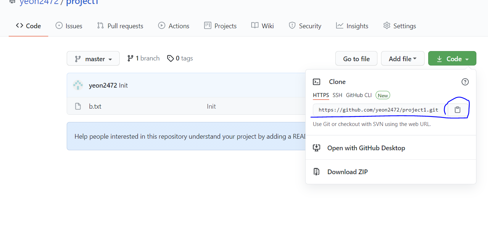

# Clone

> 원격 저장소를 복제

``` bash
$ git clone <url>
```

* 예시화면



```bash
$ git clone https://github.com/yeon2472/project1.git
```


**주의할건 폴더안에 다운받는게 아니라 폴더가 생기는거.

   그러므로 명령을 입력하려면 폴더안에 들어가거나 들어가는 명령 입력(cd <폴더>/)

