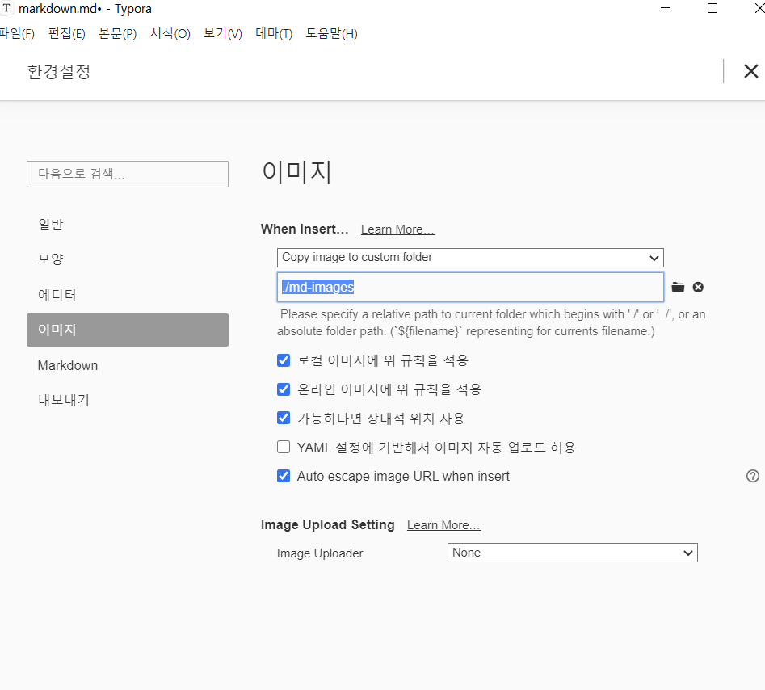

# 마크다운 문법

## 제목(heading)

문서의 구조를 잡기 위한 제목은 #을 통해 표현한다.

#의 개수로 제목의 레벨을 지정한다. (# 뒤, 띄어쓰기 필수)

### 제목3

#### 제목4

##### 제목5

###### 제목6


## 목록(list)

목록은 순서가 있는 목록과 없는 목록으로 구분된다.

1. 목록 1
2. 목록 2
   1. 목록 2-1 (tab)
   2. 목록 2-2
3. shift + tab 해서 나가기

(엔터 두번으로 나가기)

* 순서가 없는 목록 (*하고 띄어쓰기)
  * tab하면 하위로
* shift + tab


## 코드블록(마크다운으로 정리해야하는 이유)

 코드를 작성할 때 코드 블록을 활용하면, 언어별 syntax highlighting 기능이 제공됨(```)

```python
# 짝수 판별 조건식
i = 10
 if i % 2 == 0 :
    print('짝수')
```

```html
<!-- Html 주석 -->
<h1>
    Hello Friend
</h1>
```

```bash
$ git init
```

마크다운 문법이 어떻게 보이는지 바로 반영해줌

하단 </> 누르면 실제 문법상태가 보임


## 인라인 코드블록

`if`는 파이썬 조건문에서 활용되는 키워드 입니다. 


## 표

| 이름   | 나이 | 비고 |
| ------ | ---- | ---- |
| 홍길동 | 100  |      |
| 철수   | 400  |      |
| 영희   | 700  |      |

Typora에서 본문 -> 표 -> 표삽입


## 이미지

.jpg)

* typora에 아래와 같이 설정하면, 상대 경로로 쉽게 이미지 파일을 관리할 수 있다.
* 아래와 같이 설정하면 md-images 파일이 생성되어 두개를 같이 관리하면 됨
* 


## 링크

[구글](https://google.com)

대괄호안에 사이트 이름, 소괄호안에 링크주소

## 인용문

>인용문은 >를 통해 만듭니다.


## 기타

**굵게(볼드체)**

*기울임(이탤릭체)*

수직선(---)

---

~~취소선~~


