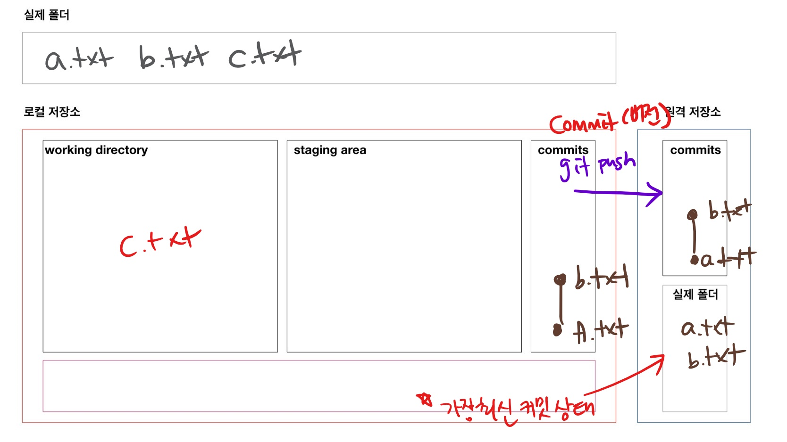

# 원격저장소(remote repository) 활용

> 원격저장소를 제공해주는 서비스 중에 GitHub을 활용

## 원격저장소 등록

```bash
$ git remote add origin <주소>
```

```bash
#예시
$ git remote add origin https://github.com/yeon2472/first.git
```

* git아, 원격저장소(remote)에 추가(add)해줘. `origin`이라는 이름으로 <주소>를.

## 원격저장소 조회

```bash
$ git remote -v
origin  https://github.com/yeon2472/First.git (fetch)
origin  https://github.com/yeon2472/First.git (push)
```

* list들을 볼 수 있는 목록

## 원격저장소 삭제

```bash
$ git remote rm origin
```

* 깃아(git), 원격저장소(remote)에 삭제(rm)할게.  `origin`을.

## push

```bash
$ git push origin master
```

* 깃아, push할게. origin의 master로

* 커밋을 push 함!
  * 현재 폴더의 파일들을 업로드하는 개념이 아님!!


[파일생성부터 원격저장소 업로드까지]


